# Design Document

## agentcore-mcp-wiring

---

## Overview

This feature completes the end-to-end AI pipeline for the AccountAi financial compliance platform. Four components — a new MCP client, a new agent entrypoint, an existing Lambda resource config, and an existing React frontend — are wired together so that a chat message typed in the browser travels through AppSync, Lambda, AWS Bedrock AgentCore (AccountAgent), a second AgentCore runtime (AccountMCP), and finally DynamoDB before a response reaches the user.

The primary engineering work is:

1. **Create** `AccountAgents/app/AccountAgent/mcp_client/client.py` — a SigV4-authenticated HTTP transport for the Strands SDK MCP client.
2. **Create** `AccountAgents/app/AccountAgent/main.py` — the agent entrypoint with a Financial Compliance system prompt and MCP-only tools.
3. **Modify** `amplify/functions/chatAgent/resource.ts` — raise `timeoutSeconds` from 120 to 900.
4. **No changes** to `src/components/ChatAssistant.tsx` or `amplify/functions/chatAgent/handler.ts`.

---

## Architecture

### Component Diagram

```mermaid
graph LR
    subgraph Browser
        A[React\nChatAssistant.tsx]
    end

    subgraph AWS AppSync
        B[GraphQL Mutation\nchatWithAgent]
    end

    subgraph AWS Lambda
        C[chatAgent handler.ts\ntimeout: 900 s]
    end

    subgraph AgentCore Runtime 1
        D[AccountAgent\nmain.py\nStrands SDK]
    end

    subgraph AgentCore Runtime 2
        E[AccountMCP\nMCP Server\nstreamable HTTP]
    end

    subgraph DynamoDB
        F[(Documents\nTable)]
    end

    A -->|client.mutations.chatWithAgent\nprompt + sessionId + ids| B
    B -->|AppSync resolver| C
    C -->|InvokeAgentRuntimeCommand\nSigV4 via SDK| D
    D -->|MCP streamable HTTP\nSigV4 via httpx| E
    E -->|boto3 DynamoDB| F
    F -->|tool result| E
    E -->|MCP response| D
    D -->|SSE stream| C
    C -->|parsed text| B
    B -->|string| A
```



### Request/Response Flow (narrative)

1. User types a message in `ChatAssistant`; `sendMessage` calls `client.mutations.chatWithAgent` with `{ prompt, sessionId, accountantId, customerId, documentId }`.
2. AppSync routes the mutation to the `chatAgent` Lambda.
3. Lambda enriches the prompt with viewer role and context IDs, then calls `InvokeAgentRuntimeCommand` against the AccountAgent AgentCore runtime ARN.
4. AccountAgent's `main.py` receives the prompt. `agent_factory()` has already constructed an `Agent` instance backed by the MCP client list and the Financial Compliance system prompt.
5. The Strands SDK agent decides which MCP tool to call (`get_document_details`, `list_client_documents`, or `calculate_tax_summary`) and issues a streamable HTTP request via `SigV4HttpxAuth`.
6. AccountMCP executes the DynamoDB query and returns the result as a streaming MCP response.
7. The agent formulates its answer (possibly looping through multiple tool calls) and streams the final answer back to Lambda as SSE.
8. Lambda's `parseSseStream` function buffers the full stream, concatenates `contentBlockDelta.delta.text` values, strips `<thinking>` blocks, and returns the clean string to AppSync.
9. AppSync returns the string to `ChatAssistant`, which applies a client-side safety net (SSE fallback strip + thinking strip) before rendering with `ReactMarkdown`.

### Security Boundary

Every hop across a runtime boundary is protected by AWS SigV4:

- **Browser → Lambda**: Cognito JWT verified by AppSync. Lambda reads Cognito group membership from `event.identity.groups` to determine `viewerRole`.
- **Lambda → AccountAgent**: The Lambda IAM role holds `bedrock-agentcore:InvokeAgentRuntime`. The AWS SDK signs the `InvokeAgentRuntimeCommand` automatically.
- **AccountAgent → AccountMCP**: `SigV4HttpxAuth` signs each HTTP request with the AgentCore runtime's execution role credentials (obtained via `boto3.Session().get_credentials()`), using service `bedrock-agentcore`.
- **AccountMCP → DynamoDB**: The AccountMCP runtime's IAM role holds the DynamoDB permissions already in place.

Multi-tenant isolation is enforced at two layers: (a) the system prompt explicitly names `accountantId` and `customerId` as prohibited cross-boundary identifiers, and (b) every MCP tool call passes the IDs supplied in the request context.

---

## Components and Interfaces

### `mcp_client/client.py`

**Responsibilities:**
- Provide `SigV4HttpxAuth`, an `httpx.Auth` subclass that signs outbound HTTP requests using AWS Signature V4.
- Expose `get_streamable_http_mcp_client()` as the single public factory function.

**Key interfaces:**

```python
class SigV4HttpxAuth(httpx.Auth):
    """
    httpx Auth implementation that signs requests with AWS SigV4.

    Raises CredentialError at construction time if boto3 cannot resolve credentials.
    """

    def __init__(
        self,
        service: str = "bedrock-agentcore",
        region: str | None = None,   # defaults to AWS_DEFAULT_REGION env var, then "us-east-1"
    ) -> None: ...

    def auth_flow(
        self, request: httpx.Request
    ) -> Generator[httpx.Request, httpx.Response, None]:
        """
        Signs `request` in-place via botocore SigV4Auth.
        Yields the modified request; adds Authorization and X-Amz-Date headers.
        """
        ...


def get_streamable_http_mcp_client() -> MCPClient:
    """
    Returns a Strands MCPClient wrapping the SigV4-authenticated
    streamable HTTP transport pointed at the AccountMCP runtime.

    Raises ConfigurationError if ACCOUNT_MCP_ARN is absent or empty.
    URL: https://bedrock-agentcore.{region}.amazonaws.com/runtimes/{encoded_arn}/invocations?qualifier=DEFAULT
    Transport timeout: 60.0 seconds.
    """
    ...
```

**Configuration surface (environment variables / constants):**

| Name | Source | Description |
|---|---|---|
| `ACCOUNT_MCP_ARN` | env var | AccountMCP runtime ARN; raised on empty/absent |
| `AWS_DEFAULT_REGION` | env var | Signing region; falls back to `us-east-1` |

### `main.py`

**Responsibilities:**
- Define `DEFAULT_SYSTEM_PROMPT`.
- Expose `agent_factory()` which builds and returns a Strands `Agent` instance.
- Preserve `_make_conversation_manager()` exactly.

**Key interfaces:**

```python
DEFAULT_SYSTEM_PROMPT: str   # module-level constant

def _make_conversation_manager() -> ConversationManager:
    """Preserved verbatim from pre-wiring state."""
    ...

def agent_factory() -> Agent:
    """
    Builds a Strands Agent with:
      - tools: one MCPClient from get_streamable_http_mcp_client() (raises if all None)
      - system_prompt: DEFAULT_SYSTEM_PROMPT
      - conversation_manager: _make_conversation_manager()
    """
    ...
```

### `amplify/functions/chatAgent/resource.ts`

Single-property change: `timeoutSeconds: 120` → `timeoutSeconds: 900`. All other properties unchanged.

### `src/components/ChatAssistant.tsx`

No changes. Already implements SSE fallback stripping and `<thinking>` block removal client-side.

---

## Data Models

### Prompt enrichment (Lambda → AccountAgent)

The Lambda encodes context as a plain-text suffix appended to the user prompt:

```
{user_prompt}

[SYSTEM CONTEXT: The user asking this question is a(n) {viewerRole}.
accountantId={accountantId}, customerId={customerId}, documentId={documentId}.
Use your tools to fetch relevant data before responding. Always respect multi-tenant boundaries.]
```

This is sent as `{ "prompt": "{enriched_prompt}" }` in the `payload` field of `InvokeAgentRuntimeCommand`.

### MCP Tool Schemas (read-only, defined in AccountMCP)

| Tool | Key Input Fields | Return Shape |
|---|---|---|
| `get_document_details` | `documentId`, `customerId`, `accountantId` | Single document record |
| `list_client_documents` | `customerId`, `accountantId` | Array of document summaries |
| `calculate_tax_summary` | `customerId`, `accountantId` | Tax summary record |

These schemas are owned by AccountMCP; `main.py` accesses them only through the Strands SDK MCP client abstraction.

### Invocation URL Construction

```
base   = "https://bedrock-agentcore.{region}.amazonaws.com"
path   = "/runtimes/{encoded_arn}/invocations"
query  = "?qualifier=DEFAULT"

encoded_arn = arn.replace(":", "%3A").replace("/", "%2F")

full_url = base + path + query
```

Example (AccountMCP ARN):
- Source: `arn:aws:bedrock-agentcore:us-east-1:559846026818:runtime/AccountAgents_AccountMCP-TXe1W1D7h0`
- Encoded: `arn%3Aaws%3Abedrock-agentcore%3Aus-east-1%3A559846026818%3Aruntime%2FAccountAgents_AccountMCP-TXe1W1D7h0`
- Full URL: `https://bedrock-agentcore.us-east-1.amazonaws.com/runtimes/arn%3Aaws%3Abedrock-agentcore%3Aus-east-1%3A559846026818%3Aruntime%2FAccountAgents_AccountMCP-TXe1W1D7h0/invocations?qualifier=DEFAULT`

---

## Correctness Properties

*A property is a characteristic or behavior that should hold true across all valid executions of a system — essentially, a formal statement about what the system should do. Properties serve as the bridge between human-readable specifications and machine-verifiable correctness guarantees.*

---

### Property 1: SigV4 Authorization Header Format

*For any* outbound HTTP request processed by `SigV4HttpxAuth.auth_flow`, the resulting `Authorization` header value SHALL begin with the scheme `AWS4-HMAC-SHA256`, and the `X-Amz-Date` header SHALL be present and match the pattern `\d{8}T\d{6}Z`.

**Validates: Requirements 1.4**

---

### Property 2: ARN Percent-Encoding Round-Trip

*For any* ARN string, the URL produced by the encoding formula (`':'` → `'%3A'`, `'/'` → `'%2F'`) SHALL contain no unencoded `:` or `/` characters within the ARN segment of the path, and the URL SHALL end with `?qualifier=DEFAULT`.

**Validates: Requirements 1.5, 7.1, 7.2, 7.4**

---

### Property 3: SSE Delta Extraction Completeness

*For any* raw SSE byte string composed of zero or more `data: {…contentBlockDelta…}` lines followed by `data: [DONE]`, the text extracted by the parser SHALL equal the exact concatenation of every `delta.text` value in document order, with no additional characters prepended or appended.

**Validates: Requirements 6.3**

---

### Property 4: Thinking Block Stripping

*For any* agent response string, after the thinking-block strip operation is applied, the resulting string SHALL contain no complete `<thinking>…</thinking>` subsequence (including multiline content); unclosed or partial tags SHALL be passed through unchanged.

**Validates: Requirements 6.4**

---

## Error Handling

### `mcp_client/client.py`

| Condition | Behaviour |
|---|---|
| `boto3.Session().get_credentials()` returns `None` | Raise `RuntimeError("AWS credentials could not be resolved")` at `SigV4HttpxAuth.__init__` time |
| `ACCOUNT_MCP_ARN` env var absent or empty | Raise `RuntimeError("ACCOUNT_MCP_ARN is required")` inside `get_streamable_http_mcp_client()` before URL construction |
| Network timeout (> 60 s) | `httpx` raises `httpx.TimeoutException`; propagates to the Strands SDK which surfaces it as a tool error |

### `main.py`

| Condition | Behaviour |
|---|---|
| `get_streamable_http_mcp_client()` raises | Propagates out of `agent_factory()`; AgentCore runtime reports an invocation error |
| All `mcp_clients` elements are `None` | Raise `RuntimeError("No MCP tools available")` before constructing `Agent` |
| Request context missing `customerId` | System prompt instructs the agent to refuse data retrieval and respond with a missing-context message |

### `chatAgent/handler.ts`

| Condition | Behaviour |
|---|---|
| `AGENT_RUNTIME_ARN` env var empty | Throw `Error("AGENT_RUNTIME_ARN environment variable is required.")` before SDK call |
| `agentResponse.response` is undefined | Return string `"The agent returned an empty response."` |
| `parseSseStream` produces empty string | Return string `"The agent returned an empty response."` |

### `ChatAssistant.tsx`

| Condition | Behaviour |
|---|---|
| `response.errors` non-empty | Throw first error message; caught by outer `catch`, displays warning bubble |
| Lambda returns raw SSE (sandbox restart fallback) | Client-side SSE strip extracts delta text; no raw `data:` lines reach the renderer |
| `<thinking>` blocks in response | Stripped by regex before `setMessages`; partial/unclosed tags passed through |

---

## Testing Strategy

### Unit Tests

Unit tests cover specific examples, edge cases, and integration points.

**`mcp_client/client.py` — `test_client.py`:**
- `SigV4HttpxAuth` raises `RuntimeError` when no AWS credentials are available (mock `boto3.Session` to return `None` creds).
- `get_streamable_http_mcp_client()` raises `RuntimeError` when `ACCOUNT_MCP_ARN` is not set.
- `get_streamable_http_mcp_client()` raises `RuntimeError` when `ACCOUNT_MCP_ARN` is set to an empty string.
- The constructed URL for the known AccountMCP ARN equals the expected encoded URL exactly (deterministic example from Requirement 7.3).

**`main.py` — `test_main.py`:**
- `agent_factory()` raises when all `mcp_clients` are `None` (mock `get_streamable_http_mcp_client` to return `None`).
- `DEFAULT_SYSTEM_PROMPT` contains the literal strings `customerId` and `accountantId`.
- `DEFAULT_SYSTEM_PROMPT` contains a prohibition against returning financial data for mismatched IDs.

**`resource.ts` — build/lint check:**
- `timeoutSeconds` value is `900` (static assertion via TypeScript type or grep in CI).

### Property-Based Tests

Property-based tests are appropriate for this feature because `SigV4HttpxAuth` and the URL encoder are pure/near-pure functions whose input space is large (arbitrary ARN strings, arbitrary HTTP requests) and where 100+ iterations meaningfully probe edge cases (colons and slashes in unexpected positions, empty path segments, region strings of varying length).

**Testing library:** [`hypothesis`](https://hypothesis.readthedocs.io/) (Python).

**Minimum iterations:** 100 per property (`@settings(max_examples=100)`).

**Tag format:** `# Feature: agentcore-mcp-wiring, Property {N}: {property_text}`

---

#### Property Test 1: SigV4 Authorization Header Format

```
# Feature: agentcore-mcp-wiring, Property 1: SigV4 Authorization header format
@given(
    method=st.sampled_from(["GET", "POST"]),
    url=st.from_regex(r"https://[\w.-]+/[\w/%-]+"),
    body=st.binary(max_size=256),
)
@settings(max_examples=100)
def test_sigv4_header_format(method, url, body):
    auth = SigV4HttpxAuth(service="bedrock-agentcore", region="us-east-1")
    request = httpx.Request(method, url, content=body)
    signed = list(auth.auth_flow(request))[0]   # first yielded request is the signed one
    assert signed.headers["authorization"].startswith("AWS4-HMAC-SHA256")
    assert re.fullmatch(r"\d{8}T\d{6}Z", signed.headers["x-amz-date"])
```

*Uses mocked credentials so no real AWS call is made.*

---

#### Property Test 2: ARN Percent-Encoding Round-Trip

```
# Feature: agentcore-mcp-wiring, Property 2: ARN percent-encoding round-trip
@given(
    account_id=st.from_regex(r"\d{12}"),
    runtime_suffix=st.from_regex(r"[A-Za-z0-9_-]{8,32}"),
    region=st.sampled_from(["us-east-1", "eu-west-1", "ap-southeast-2"]),
)
@settings(max_examples=100)
def test_arn_encoding(account_id, runtime_suffix, region):
    arn = f"arn:aws:bedrock-agentcore:{region}:{account_id}:runtime/{runtime_suffix}"
    url = _build_invocation_url(arn, region)
    # ARN segment must contain no raw colons or slashes
    arn_segment = url.split("/runtimes/")[1].split("/invocations")[0]
    assert ":" not in arn_segment
    assert "/" not in arn_segment
    assert url.endswith("?qualifier=DEFAULT")
```

*`_build_invocation_url` is extracted as a pure helper to allow unit testing without httpx.*

---

#### Property Test 3: SSE Delta Extraction Completeness

```
# Feature: agentcore-mcp-wiring, Property 3: SSE delta extraction completeness
@given(
    texts=st.lists(st.text(max_size=80), min_size=0, max_size=20),
)
@settings(max_examples=100)
def test_sse_extraction(texts):
    # Build a synthetic SSE stream from the list of text fragments
    lines = []
    for t in texts:
        payload = json.dumps({"event": {"contentBlockDelta": {"delta": {"text": t}}}})
        lines.append(f"data: {payload}")
    lines.append("data: [DONE]")
    raw = "\n".join(lines)
    assert parse_sse_stream(raw) == "".join(texts)
```

*`parse_sse_stream` is the pure extraction function (no `<thinking>` strip) to allow isolated testing.*

---

#### Property Test 4: Thinking Block Stripping

```
# Feature: agentcore-mcp-wiring, Property 4: Thinking block stripping
@given(
    prefix=st.text(max_size=200),
    inner=st.text(max_size=500),
    suffix=st.text(max_size=200),
)
@settings(max_examples=100)
def test_thinking_strip(prefix, inner, suffix):
    full = f"{prefix}<thinking>{inner}</thinking>{suffix}"
    result = strip_thinking_blocks(full)
    assert "<thinking>" not in result
    assert "</thinking>" not in result
    # Content outside thinking blocks must be preserved
    assert prefix in result or prefix.strip() == ""
    assert suffix in result or suffix.strip() == ""
```

*`strip_thinking_blocks` is the pure regex helper extracted for testing.*

---

### Integration Tests

The following scenarios require a real (or mocked) AgentCore runtime and are tested with 1–3 representative examples rather than property-based testing:

| Scenario | What is verified | Test type |
|---|---|---|
| Lambda invokes AccountAgent and receives a non-empty string | End-to-end pipeline health | Integration (1 example) |
| AccountMCP tool `list_client_documents` returns records for known `accountantId`/`customerId` | DynamoDB wiring | Integration (2 examples) |
| Timeout: Lambda completes within 900 s for a multi-tool-call conversation | Timeout headroom | Integration (1 example) |

Integration tests are run in a separate CI stage and require AWS credentials with `bedrock-agentcore:InvokeAgentRuntime` permission.

---

## File Structure

### Files to Create

```
AccountAgents/app/AccountAgent/
├── mcp_client/
│   ├── __init__.py          (empty, marks package)
│   └── client.py            (SigV4HttpxAuth, get_streamable_http_mcp_client)
├── main.py                  (DEFAULT_SYSTEM_PROMPT, agent_factory, _make_conversation_manager)
└── tests/
    ├── test_client.py       (unit + property tests for client.py)
    └── test_main.py         (unit tests for main.py)
```

### Files to Modify

```
amplify/functions/chatAgent/
└── resource.ts              (timeoutSeconds: 120 → 900, single line change)
```

### Files Unchanged

```
amplify/functions/chatAgent/handler.ts
src/components/ChatAssistant.tsx
amplify/backend.ts
```
